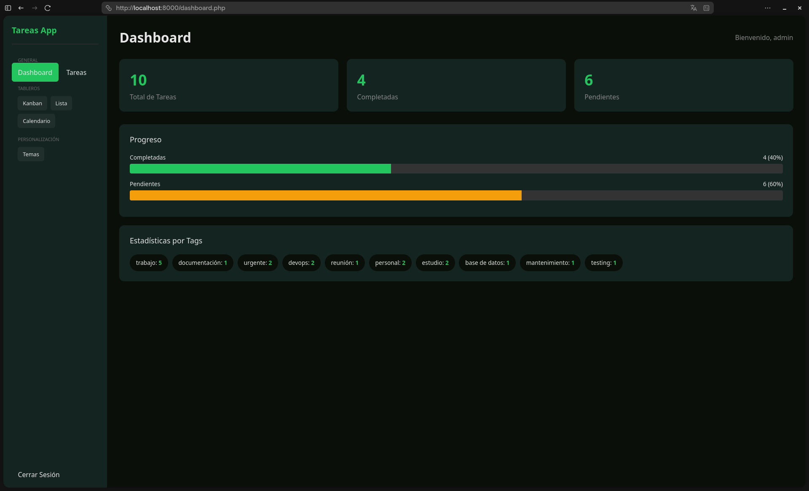
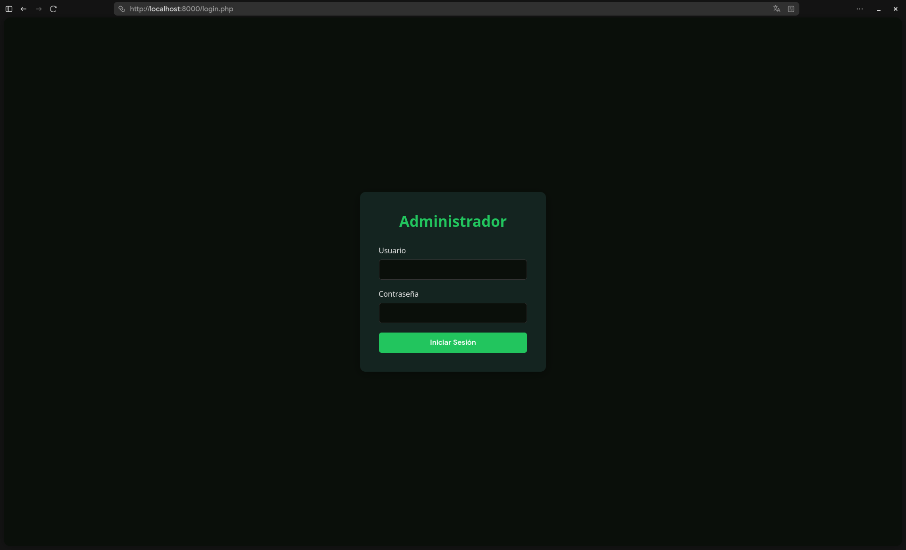
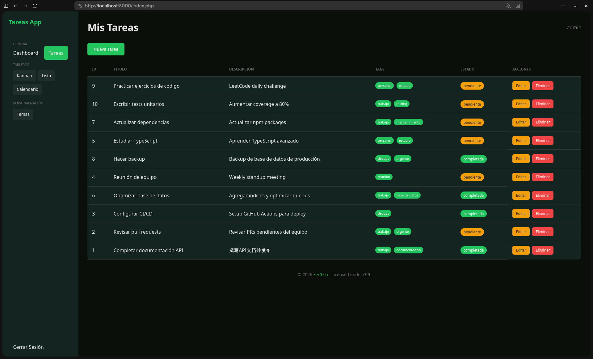
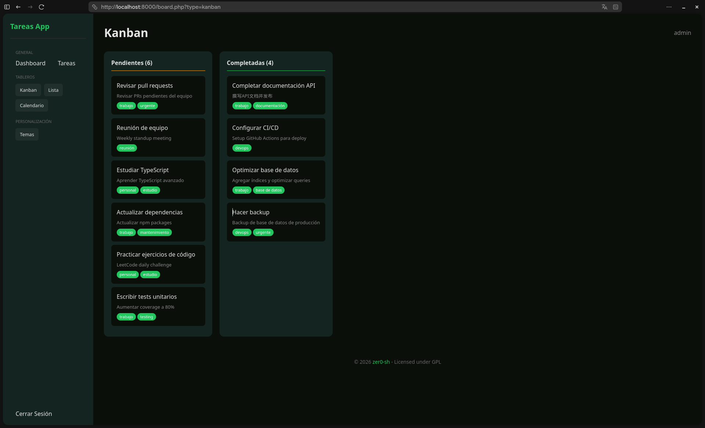
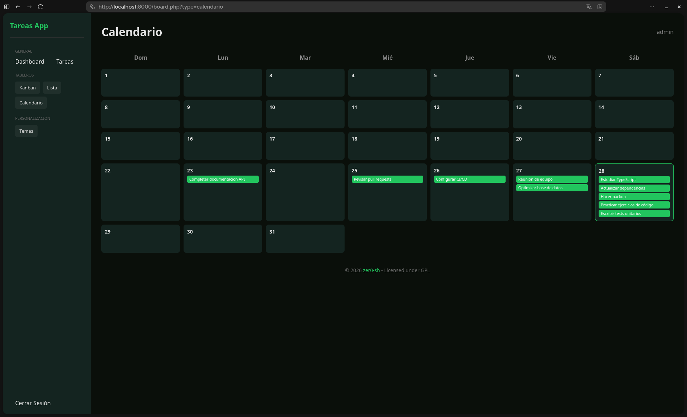
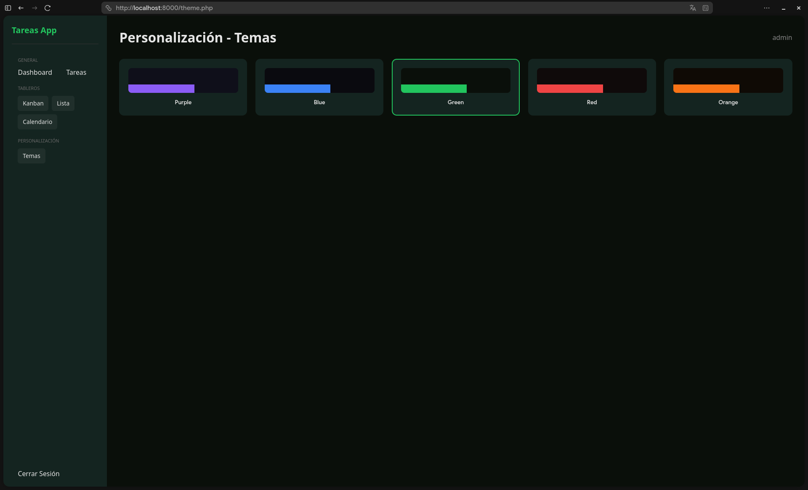

# PHP Tareas CRUD

CRUD de tareas con PHP puro, login, dashboard y temas.



## Requisitos

- PHP 7.4+

## Uso

```bash
php -S localhost:8000
```

Abre http://localhost:8000

## Login

- Usuario: `admin`
- Contraseña: `admin`



## Características

- Login con sesión
- Dashboard con estadísticas (total, completadas, pendientes)
- Gráfico de progreso barras
- Estadísticas por tags
- Temas personalizables (5 colores)
- Modo oscuro
- CRUD de tareas con tags
- Tableros: Kanban, Lista, Calendario

### Dashboard


### Tareas



### Kanban



### Calendario



### Temas



## Licencia

Licensed under GPL
